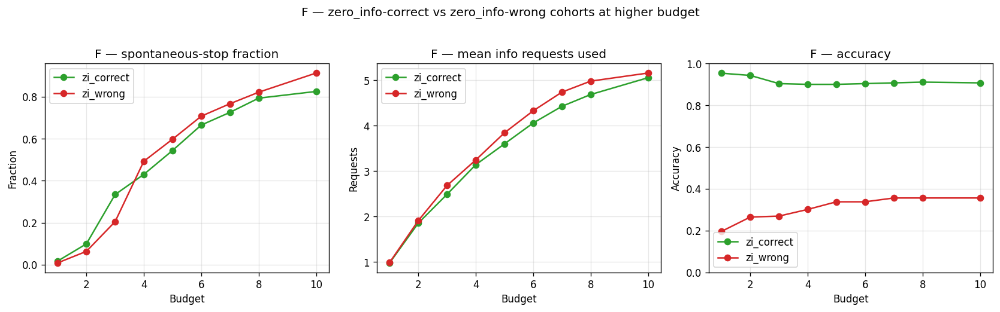
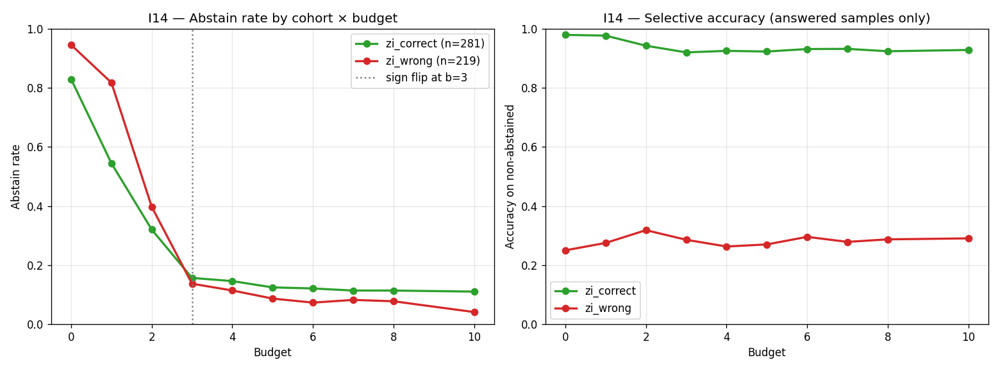

# vlm-budget-eval

Budget-constrained sequential information-seeking evaluation for vision-language models on ScienceQA.

**연구 질문**: VLM에게 작은 정보 budget이 주어졌을 때, *지금 답할지 / 텍스트를 더 요청할지 / 시각 정보를 더 요청할지* 매 스텝 잘 판단할 수 있는가?

## 프로토콜 한 줄 요약

매 스텝 모델은 JSON 한 줄을 출력한다:

- `{"action": "ANSWER", "choice": "A"}` — 답 commit, cost **0**
- `{"action": "REQUEST_TEXT"}` — 다음 문장 공개, cost **1**
- `{"action": "REQUEST_VISUAL"}` — 다음 이미지 타일 공개, cost **1**

Budget이 소진되면 force-answer turn. 최종 답이 정답이면 `is_correct=True`. 텍스트 힌트는 `hint + lecture`를 문장 단위로 잘라 하나씩, 비전 힌트는 원본 이미지를 2×2 타일로 잘라 하나씩 공개.

## Headline results — Qwen2.5-VL-7B, n=500


| run | budget | accuracy | text req | visual req | note |
|---|---:|---:|---:|---:|---|
| `zero_info` | 0 | 0.562 | 0.00 | 0.00 | floor (사전지식만) |
| `sweep_b2` | 2 | 0.646 | 1.57 | 0.31 | 작은 budget local max |
| `main_b6` (model adaptive) | 6 | 0.656 | 3.28 | 0.87 | |
| `nudge_b6` (prompt → visual) | 6 | 0.660 | 0.01 | 3.72 | +0.4pp only |
| **`always_visual`** | 6 | **0.680** | 0.00 | 4.00 | 모델 정책보다 나음 |
| `full_info` | ∞ | 0.700 | 11.72 | 4.00 | ceiling |


### Phase 0 핵심 관찰 4가지 (정책 비교)

1. **모델은 강한 텍스트 편향**: `main_b6`은 text 3.28 / visual 0.87 (≈3.8× 텍스트 선호). 그런데 자동 `always_visual`이 **+2.4pp** 더 높다 — ScienceQA에서는 타일 하나가 문장 하나보다 정보 효율적인데 모델은 반대로 행동.
2. **Budget curve는 비단조적**: b=2에서 local max(0.646) → b=3에서 **dip**(0.626) → b≥7에서 포화(~0.666). 같은 seed인데 budget만 바꾸면 모델 경로가 달라지며 퇴보도 발생.
3. **Prompt nudge는 modality 선호를 즉시 뒤집지만 정확도는 +0.4pp만**: `text 3.28→0.01` / `visual 0.87→3.72`로 완전 반전됐는데 전체 accuracy는 0.656→0.660. 사회과학 subject만 보면 −5.3pp로 **악화** — 일률적 nudge는 너무 무딘 도구.
4. **visual_only 정답 43 samples(8.6%)를 main이 놓침**: 이 코호트에서 모델은 평균 text 3.91 / visual 0.81 사용. 비전이 답이었던 곳에서조차 텍스트 도배.

### Phase 1 추가 발견 12가지 (Calibration · Difficulty · Abstention)

기존 budget sweep 데이터 + ABSTAIN action 추가 + 100샘플 image-masked 변형으로 ⑤–⑯ 12개 발견. paper motivation 후보 4개:



- **⑧** 모델은 `zi_correct`(사전지식 충분)와 `zi_wrong`(불충분) 코호트에 거의 같은 양의 정보를 요청 (b=6에서 4.06 vs 4.33). **"이미 안다"를 인지하지 못함** + 추가 정보가 쉬운 샘플을 망침(0.954→0.904).
- **⑪** 두 코호트의 budget-accuracy 곡선이 b=1에서 정확히 교차. **쉬운 샘플은 정보가 망치고, 어려운 샘플은 정보가 살림** — 매크로 plateau(0.700)의 메커니즘.
- **⑭** 4번째 action으로 ABSTAIN을 노출하면 b=6 vanilla 모델이 **anti-calibrated** (zi_correct 12.1% > zi_wrong 7.3% abstain) — 어려운 샘플을 abstain하는 게 아니라 쉬운 샘플을 abstain.
- **⑮** Calibration → anti-calibration **flip이 정확히 b=3에서 일어남** — ④ macro dip과 같은 위치. 두 phenomenon이 한 메커니즘 → budget-conditioning과 abstention reward를 **함께** 설계해야 한다는 정량적 근거.



12가지 풀 리스트 + 산출 데이터: [`docs/insights/insights_ko.md`](./docs/insights/insights_ko.md) (한국어) / [`docs/insights/insights.md`](./docs/insights/insights.md) (English). 진행 추적 + paper plan vs 현재 상태: [`references/roadmap_ko.md`](./references/roadmap_ko.md) / [`references/project_ko.md`](./references/project_ko.md). 인터랙티브 데모: [`notebooks/experiment.ipynb`](./notebooks/experiment.ipynb) (37셀, 사전 실행, 한국어 — Phase 0 기준).

## Quick start

```bash
uv sync

# 1. 전처리 (ScienceQA 500개 다운로드 + 2×2 타일 크롭)
uv run python scripts/preprocessing.py --max-samples 500 --tile-grid 2

# Phase 0 — 정책 비교
uv run python scripts/experiment_runner.py        # main b=6
uv run python scripts/run_sweep.py                # zero_info / full_info / always_text / always_visual + b=4/8
uv run python scripts/run_dense_sweep.py          # b=1,2,3,5,7,10 (traces 저장)
uv run python scripts/run_nudge.py                # visual-favor prompt nudge
uv run python scripts/summarize_runs.py           # all_runs_summary.csv 롤업
uv run python scripts/analyze_runs.py             # budget curve / modality mix / subject / bias bucket

# Phase 1a · 1b — 기존 trace 재분석 (GPU 불필요, 각 1-2분)
uv run python scripts/analyze_calibration.py      # ⑤–⑨
uv run python scripts/analyze_difficulty.py       # ⑩–⑫

# Phase 1c — ABSTAIN action 프로브
uv run python scripts/run_abstention.py           # abstain_b0 + abstain_b6 (~10분)
uv run python scripts/analyze_abstention.py       # ⑬–⑭

# Phase 1d — anti-calibration sweep + image-masking
uv run python scripts/run_abstention_sweep.py     # b=1..5,7,8,10 (~30분)
uv run python scripts/preprocessing_masked.py     # preproc_masked/ (100샘플, 50/50 cohort)
uv run python scripts/run_abstention_masked.py    # abstain_masked_b0/4/6 (~10분)
uv run python scripts/analyze_abstention_phase1d.py  # ⑮–⑯
```

500 샘플 × 정책 1개 ≈ **3–7분** (Qwen2.5-VL-7B-Instruct + H200, bfloat16). Phase 1 전체 재현 ≈ **1시간**.

## Repo structure

```
src/vlm_budget_eval/        # 핵심 엔진 (EvalConfig + run_episode + ABSTAIN)
  budget_eval.py
scripts/                    # 실행 가능 드라이버
  preprocessing.py              # ScienceQA → samples.parquet + tile PNGs
  preprocessing_masked.py       # preproc_masked/ (100샘플, white-tile 변형) — Phase 1d
  experiment_runner.py          # main budget=6 드라이버
  run_sweep.py                  # 베이스라인 + b=4/b=8
  run_dense_sweep.py            # b=1,2,3,5,7,10 dense sweep
  run_nudge.py                  # prompt-nudge 변형
  run_abstention.py             # ABSTAIN 프로브 b=0/6 — Phase 1c
  run_abstention_sweep.py       # ABSTAIN sweep b=1..5,7,8,10 — Phase 1d
  run_abstention_masked.py      # ABSTAIN on masked b=0/4/6 — Phase 1d
  summarize_runs.py             # all_runs_summary.csv 롤업
  analyze_runs.py               # budget curve, modality mix, subject, bias bucket
  analyze_calibration.py        # Phase 1a (calibration metrics A–F)
  analyze_difficulty.py         # Phase 1b (cohort × budget × subject)
  analyze_abstention.py         # Phase 1c (coverage / Φ / cohort-aligned)
  analyze_abstention_phase1d.py # Phase 1d (anti-cal evolution + masking)
notebooks/experiment.ipynb  # 37셀 데모 (한국어, 사전 실행 — Phase 0 기준)
docs/
  figures/                  # README + insights 헤드라인 figure (tracked)
  insights/                 # insights.md (English) + insights_ko.md (한국어)
  experiments/              # 개별 실험 결과 노트
configs/                    # 실험 config YAML (TBD)
tests/                      # 테스트 (TBD)
references/
  project.md / project_ko.md   # paper-scope 연구 계획 (frozen reference)
  roadmap.md / roadmap_ko.md   # 살아 있는 진행 추적 (Phase 0–5 + insight backlog)
CLAUDE.md                   # 프로젝트 규약 (Claude Code 용)
```

Output artifacts(`preproc/`, `preproc_masked/`, `output/`, `output2/`)는 `.gitignore` 처리. 재현 시 위 pipeline으로 다시 생성.

## Setup notes

- **모델**: `Qwen/Qwen2.5-VL-7B-Instruct`, `torch_dtype=bfloat16`, `device_map="auto"`.
- `torch==2.9.1` + `pytorch-cu130` 인덱스에 pin (호스트 CUDA 13 toolchain 매칭). 바꾸려면 toolchain도 같이 바꿔야 함.
- 모든 run: `random_seed=42`, `temperature=0` (greedy).
- GPU: ~17GB 메모리 사용 (H200에서 검증).

## Limitations

- **단일 모델 평가** (Qwen2.5-VL-7B). 다른 VLM(LLaVA, InternVL 등)에서 동일 편향이 있는지는 미확인 — Phase 2 / 5 sanity로 이월.
- **단일 데이터셋** (ScienceQA). image-required-by-construction 벤치마크(V*Bench, HR-Bench)는 미도입 — Phase 2에서 추가 예정.
- **타일 그리드 고정** (2×2 = 4 타일). 3×3 또는 4×4에서는 budget 단가 경제가 달라짐.
- **Subject 분포 편향**: 410/500이 natural science, 76 social science, 14 language science.
- **Greedy decoding** (T=0). Sampling에서는 결정 경로가 달라질 수 있음.
- **단일 nudge prompt**: 다른 표현/길이에서는 효과가 다를 수 있음.
- **Phase 1c sufficiency-known mini-set 미구현**: ROADMAP 원안의 MM-UPD subset 대신 zi-cohort proxy 사용. Phase 1d ⑯의 ScienceQA image-masking 실험은 caveat 있음 — text 만으로 답이 derivable한 케이스가 많아서 결정적 sufficiency 테스트는 V*Bench/HR-Bench로 이월(I15).

다음 단계는 [`references/roadmap_ko.md`](./references/roadmap_ko.md) §7 참고 — 현재 Phase 2(action space 확장 + 새 벤치마크) 시작 단계.

## Citation / references

- Dataset: [`derek-thomas/ScienceQA`](https://huggingface.co/datasets/derek-thomas/ScienceQA) (HuggingFace port of [ScienceQA](https://scienceqa.github.io/))
- Model: [`Qwen/Qwen2.5-VL-7B-Instruct`](https://huggingface.co/Qwen/Qwen2.5-VL-7B-Instruct)
