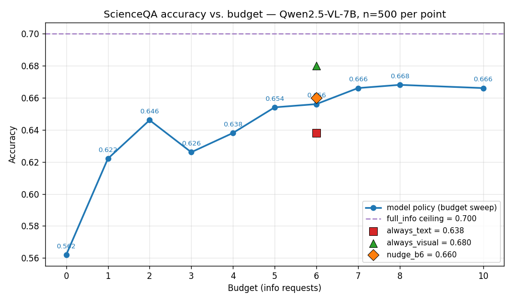
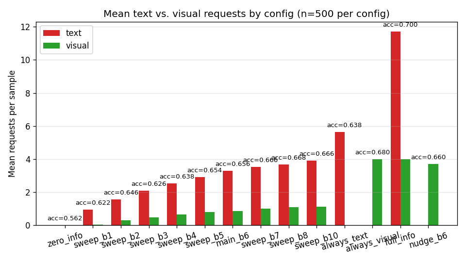

# vlm-budget-eval

Budget-constrained sequential information-seeking evaluation for vision-language models on ScienceQA.

**연구 질문**: VLM에게 작은 정보 budget이 주어졌을 때, *지금 답할지 / 텍스트를 더 요청할지 / 시각 정보를 더 요청할지* 매 스텝 잘 판단할 수 있는가?

## 프로토콜 한 줄 요약

매 스텝 모델은 JSON 한 줄을 출력한다:

- `{"action": "ANSWER", "choice": "A"}` — 답 commit, cost **0**
- `{"action": "REQUEST_TEXT"}` — 다음 문장 공개, cost **1**
- `{"action": "REQUEST_VISUAL"}` — 다음 이미지 타일 공개, cost **1**

Budget이 소진되면 force-answer turn. 최종 답이 정답이면 `is_correct=True`. 텍스트 힌트는 `hint + lecture`를 문장 단위로 잘라 하나씩, 비전 힌트는 원본 이미지를 2×2 타일로 잘라 하나씩 공개.

## Headline results — Qwen2.5-VL-7B, n=500



| run | budget | accuracy | text req | visual req | note |
|---|---:|---:|---:|---:|---|
| `zero_info` | 0 | 0.562 | 0.00 | 0.00 | floor (사전지식만) |
| `sweep_b2` | 2 | 0.646 | 1.57 | 0.31 | 작은 budget local max |
| `main_b6` (model adaptive) | 6 | 0.656 | 3.28 | 0.87 | |
| `nudge_b6` (prompt → visual) | 6 | 0.660 | 0.01 | 3.72 | +0.4pp only |
| **`always_visual`** | 6 | **0.680** | 0.00 | 4.00 | 모델 정책보다 나음 |
| `full_info` | ∞ | 0.700 | 11.72 | 4.00 | ceiling |



### 핵심 관찰 4가지

1. **모델은 강한 텍스트 편향**: `main_b6`은 text 3.28 / visual 0.87 (≈3.8× 텍스트 선호). 그런데 자동 `always_visual`이 **+2.4pp** 더 높다 — ScienceQA에서는 타일 하나가 문장 하나보다 정보 효율적인데 모델은 반대로 행동.
2. **Budget curve는 비단조적**: b=2에서 local max(0.646) → b=3에서 dip(0.626) → b≥7에서 포화(~0.666). 같은 seed인데 budget만 바꾸면 모델 경로가 달라지며 퇴보도 발생.
3. **Prompt nudge는 modality 선호를 즉시 뒤집지만 정확도는 +0.4pp만**: `text 3.28→0.01` / `visual 0.87→3.72`로 완전 반전됐는데 전체 accuracy는 0.656→0.660. 사회과학 subject만 보면 −5.3pp로 **악화** — 일률적 nudge는 너무 무딘 도구.
4. **visual_only 정답 43 samples(8.6%)를 main이 놓침**: 이 코호트에서 모델은 평균 text 3.91 / visual 0.81 사용. 비전이 답이었던 곳에서조차 텍스트 도배.

자세한 분석은 [`INSIGHTS.md`](./INSIGHTS.md) (한국어), 인터랙티브 데모는 [`experiment.ipynb`](./experiment.ipynb) (37셀, 사전 실행, 한국어).

## Quick start

```bash
uv sync

# 1. 전처리 (ScienceQA 다운로드 + 2×2 타일 크롭)
uv run python preprocessing.py --max-samples 500 --tile-grid 2

# 2. 메인 실험 (budget=6)
uv run python experiment_runner.py

# 3. 베이스라인 (zero_info, full_info, always_text, always_visual, b=4, b=8)
uv run python run_sweep.py

# 4. Dense budget sweep (b=1,2,3,5,7,10; traces 저장)
uv run python run_dense_sweep.py

# 5. Prompt-nudge 변형
uv run python run_nudge.py

# 6. 분석 + plot
uv run python summarize_runs.py
uv run python analyze_runs.py
```

500 샘플 × 정책 1개 ≈ **3–7분** (Qwen2.5-VL-7B-Instruct + H200, bfloat16).

## Repo structure

```
budget_eval.py         # 핵심 엔진 (EvalConfig + run_episode)
preprocessing.py       # ScienceQA → samples.parquet + tile PNGs
experiment_runner.py   # main budget=6 드라이버
run_sweep.py           # 베이스라인 + b=4/b=8
run_dense_sweep.py     # b=1,2,3,5,7,10 dense sweep
run_nudge.py           # prompt-nudge 변형
summarize_runs.py      # all_runs_summary.csv 롤업
analyze_runs.py        # budget curve, modality mix, subject crosstab, bias bucket
experiment.ipynb       # 37셀 데모 노트북 (한국어, 사전 실행)
INSIGHTS.md            # 발견·한계·다음 단계 (한국어)
CLAUDE.md              # 프로젝트 규약 (Claude Code 용)
```

Output artifacts(`preproc/`, `output/`, `output2/`)는 `.gitignore` 처리. 재현 시 위 pipeline으로 다시 생성.

## Setup notes

- **모델**: `Qwen/Qwen2.5-VL-7B-Instruct`, `torch_dtype=bfloat16`, `device_map="auto"`.
- `torch==2.9.1` + `pytorch-cu130` 인덱스에 pin (호스트 CUDA 13 toolchain 매칭). 바꾸려면 toolchain도 같이 바꿔야 함.
- 모든 run: `random_seed=42`, `temperature=0` (greedy).
- GPU: ~17GB 메모리 사용 (H200에서 검증).

## Limitations

- **단일 모델 평가** (Qwen2.5-VL-7B). 다른 VLM(LLaVA, InternVL 등)에서 동일 편향이 있는지는 미확인.
- **타일 그리드 고정** (2×2 = 4 타일). 3×3 또는 4×4에서는 budget 단가 경제가 달라짐.
- **Subject 분포 편향**: 410/500이 natural science, 76 social science, 14 language science.
- **Greedy decoding** (T=0). Sampling에서는 결정 경로가 달라질 수 있음.
- **단일 nudge prompt**: 다른 표현/길이에서는 효과가 다를 수 있음.

다음 단계 후보는 [`INSIGHTS.md`](./INSIGHTS.md)의 *다음 단계 후보* 섹션 참고.

## Citation / references

- Dataset: [`derek-thomas/ScienceQA`](https://huggingface.co/datasets/derek-thomas/ScienceQA) (HuggingFace port of [ScienceQA](https://scienceqa.github.io/))
- Model: [`Qwen/Qwen2.5-VL-7B-Instruct`](https://huggingface.co/Qwen/Qwen2.5-VL-7B-Instruct)
