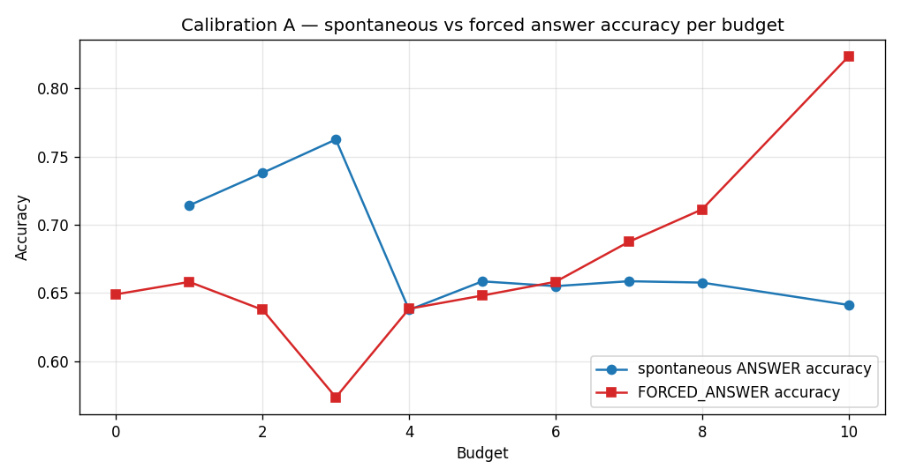
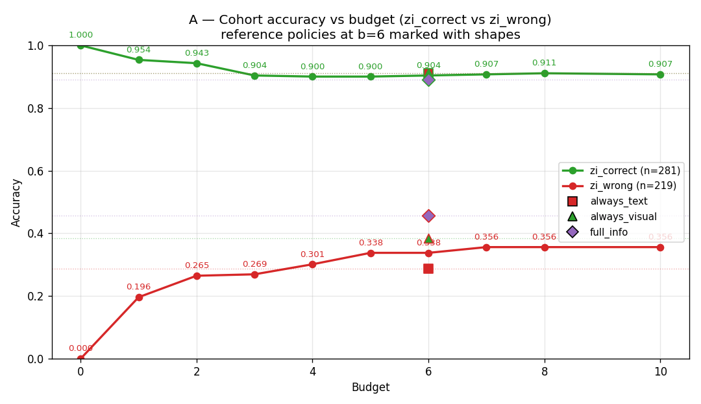
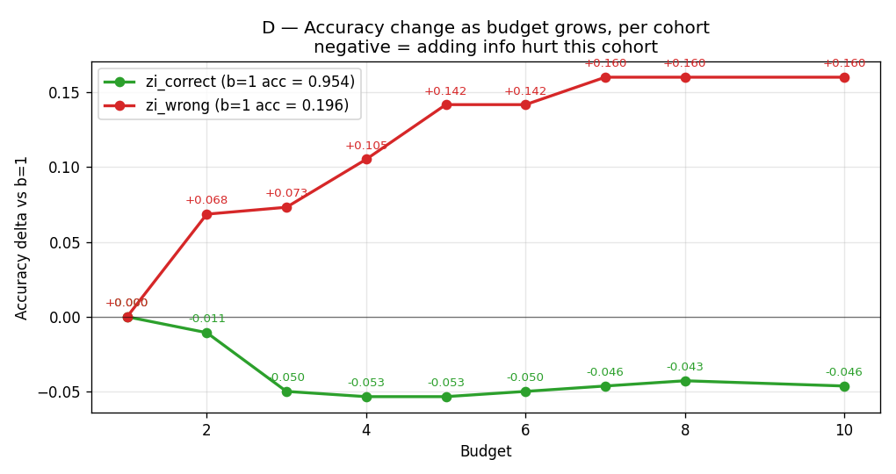
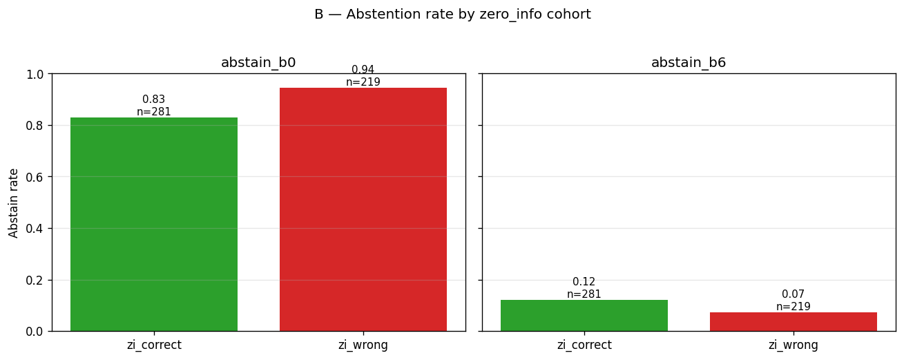

# 연구 방향 및 채택 가능성 리뷰 — 2026-04-25

> **검토 대상:** `references/project.md`, `references/roadmap.md`, `docs/insights/insights.md` (2026-04-24 시점)
> **검토자:** Claude (자동 일일 리뷰)
> **검토 목표:** ① 가설–증거 정합성 점검, ② NeurIPS/EMNLP 2026 채택 가능성 분석, ③ 채택 가능성을 높이기 위한 방향 수정안 제시

---

## 0. 한 줄 요약 (TL;DR)

> **현재 상태로 NeurIPS 2026 본 트랙 제출은 일정상 사실상 불가능하며**(전체 파이프라인 미완료), 가장 합리적인 경로는 **Phase 1 진단 결과 단독으로 EMNLP 2026 (ACL Rolling Review 2026년 5월 사이클)에 진단/분석 페이퍼로 제출**하면서, **풀 파이프라인은 ICLR 2027 (~2026년 9월 마감)을 목표로 병행 개발**하는 헤지 전략을 권장합니다.

---

## 1. 현재 연구 상태 (2026-04-25 기준)

### 1.1 완료된 것 (Phase 0 + Phase 1a/1b/1c)

| Phase | 결과물 | 핵심 발견 |
|---|---|---|
| Phase 0 | 베이스라인 평가 엔진 (`budget_eval.py`) — 3-액션 어휘 (`ANSWER` / `REQUEST_TEXT` / `REQUEST_VISUAL`) | 예산 B ∈ {0..6} 별 정확도 곡선, 모달리티 믹스 |
| Phase 1a | 보정(Calibration) 진단 | **자발적 답변 vs 강제 답변 정확도 갭** (Insight ⑩, ⑭) |
| Phase 1b | 난이도(Difficulty) 진단 | **Zero-info Correct vs Wrong 코호트 분리, b=1 에서 교차** (Insight ⑪) |
| Phase 1c | 기권(Abstention) 진단 | **vanilla 기권 옵션의 anti-calibration** (Insight ⑭) |

### 1.2 미완료된 것 (Phase 2–5, 진행률 0%)

| Phase | 내용 | 예상 소요 |
|---|---|---|
| Phase 2 | 6-액션 어휘로 확장 (`ABSTAIN` / `THINK` / `REQUEST_HI_RES` / `ZOOM(bbox)` / `RETRIEVE` 추가), 예산 B를 정책의 입력으로 | 1~2주 |
| Phase 3 | 감독 미세조정(Supervised Fine-Tuning, SFT; LoRA r=16) 데이터 파이프라인 + 학습 | 2~3주 |
| Phase 4 | 그룹 상대 정책 최적화(Group Relative Policy Optimization, GRPO) 학습 | 2~4주 |
| Phase 5 | 절제 실험(ablation), 추가 벤치마크(MMMU/HR-Bench) 검증 | 1~2주 |

→ **Phase 2~5 합산 최소 6주, 실제로는 8~12주 필요.**

---

## 2. 가설 ↔ 증거 정합성 분석

### 2.1 핵심 가설 (project.md에서 추출)

**H1.** VLM(시각-언어 모델)은 예산 B를 정책의 입력으로 받으면, **B에 따라 행동 분포를 적응적으로 변화**시킬 수 있다.

**H2.** 이종 행동 공간(텍스트 요청 / 시각 요청 / 줌 / 기권 / 사고연쇄(CoT) / 검색)은 **단일 모달리티 행동만 있는 베이스라인보다 같은 예산에서 더 높은 정확도**를 달성한다 (파레토 우위).

**H3.** SFT → GRPO 2단계 학습은 **사전 학습된 VLM의 무계산 정책을 명시적 예산-인식 정책으로 변환**할 수 있다.

**H4.** 모델은 "내가 이미 안다"를 인식하여 **쉬운 샘플에서 정보 요청을 절약**할 수 있다.

### 2.2 현재까지의 증거 vs 가설

| 가설 | 현재 증거 (Phase 1) | 정합성 | 코멘트 |
|---|---|---|---|
| **H1** (예산 적응) | 실험 데이터 없음. 예산을 **외부 환경 변수**로만 사용했고, 정책의 입력으로 넣어본 적 없음. | ⚠️ **미검증** | Phase 2 핵심 과제. 가설이 사실상 미테스트 상태. |
| **H2** (이종 행동의 파레토 우위) | 텍스트 vs 시각 2개 행동만 비교. 줌/기권/CoT/검색은 미구현. | ⚠️ **부분 검증** | 현재 데이터로는 "텍스트가 시각보다 약간 우세" 정도만 말 가능. |
| **H3** (SFT→GRPO 효과) | 학습 자체를 시작하지 않음. | ❌ **미검증** | 페이퍼의 핵심 contribution 인데 증거 0. |
| **H4** (자기-인식 절약) | **Insight ⑧이 정면으로 반박**: 모델은 zi_correct(쉬움)와 zi_wrong(어려움)에 거의 같은 양의 정보를 요청함. | ❌ **반증됨** | 이게 가장 중요한 발견인 동시에 가장 심각한 문제. |

### 2.3 정합성 진단

- **Phase 1은 "문제 제기(motivation)"로서는 매우 강력**합니다. 특히 Insight ⑧ (자기-인식 부재), ⑪ (코호트 교차), ⑭ (anti-calibrated 기권)는 명확하고 재현 가능한 결함을 보여줍니다.
- **하지만 이 결함들은 페이퍼의 "claimed contribution"(SFT+GRPO로 해결한다)과 짝지어졌을 때만 의미가 있습니다.** 현재는 진단만 있고 처방이 없습니다.
- **H4가 반증되었다는 사실**은 양날의 검입니다.
  - 긍정: "현재 VLM은 예산-인식이 안 된다" 라는 강한 동기.
  - 부정: 만약 SFT+GRPO 로도 H4를 풀지 못하면, 페이퍼의 메인 narrative 가 무너집니다. 즉 Phase 3~4 가 단순 무어가 아니라 **결과적으로 H4를 회복시켜야** 합니다.

---

## 3. 채택 마감일 점검

| 학회 | 마감 | 오늘로부터 | 본 트랙 풀 파이프라인 가능? |
|---|---|---|---|
| **NeurIPS 2026** | 초록: 2026-05-04 / 본문: 2026-05-06 | **9–11 일** | ❌ 절대 불가 (Phase 2~5 미완) |
| **EMNLP 2026** (ARR 2026-05 사이클) | 2026-05-15 | **20 일** | ❌ 풀 파이프라인 불가, ⚠️ 진단 단독은 가능 |
| **NeurIPS 2026 워크샵** | (대개 7~8월) | ~3개월 | ✅ 풀 파이프라인 가능성 |
| **ICLR 2027** | ~2026-09 (예상) | ~5개월 | ✅ 풀 파이프라인 충분 |

> 출처: [NeurIPS 2026 Dates](https://neurips.cc/Conferences/2026/Dates), [ACL Rolling Review Dates](http://aclrollingreview.org/dates), [EMNLP 2026 Call for Papers](https://2026.emnlp.org/calls/main_conference_papers/)

---

## 4. 채택 가능성 분석

### 4.1 시나리오별 채택 확률 추정

| 시나리오 | 형태 | 채택 확률 (정성적) | 이유 |
|---|---|---|---|
| **A.** 현재 상태로 NeurIPS 2026 풀 페이퍼 강행 | "9일 안에 SFT+GRPO 완료" | **~1%** | 물리적으로 불가능. 데드라인 누락 시 desk reject. |
| **B.** Phase 1 진단만으로 NeurIPS 2026 본 트랙 | 분석 페이퍼 | **~10%** | NeurIPS 본 트랙은 강한 method를 선호. "흥미로운 진단" 만으로는 약함. 게다가 ScienceQA 단일 벤치마크. |
| **C.** Phase 1 진단만으로 EMNLP 2026 본 트랙 (ARR May) | 분석/empirical 페이퍼 | **~25–30%** | EMNLP 가 실증/분석 페이퍼에 더 우호적. 단 "VLM 페이퍼인데 NLP 학회" 라는 fit 우려는 있음. Limitations 섹션 강화 필수. |
| **D.** Phase 1+2 (예산-인식 정책 학습 1차 결과) → EMNLP | 진단 + mini-method | **~35–40%** | 진단의 강점이 mini-method 의 결과로 검증됨. 20일 안에 Phase 2 만 완성 가능한지가 관건. |
| **E.** 풀 파이프라인 → NeurIPS 워크샵 | 워크샵 페이퍼 | **~50–60%** | 워크샵은 진입 장벽이 낮고 시간 여유 있음. 단 본 트랙 임팩트는 낮음. |
| **F.** 풀 파이프라인 → ICLR 2027 | 풀 페이퍼 | **~25–30%** | 시간이 충분하고, 5개월간 추가 데이터/벤치마크/절제 실험 가능. ICLR도 최근 multimodal RL 페이퍼 활발. |
| **G.** D + F 병행 (헤지) | EMNLP는 진단 페이퍼, ICLR은 풀 페이퍼 | **~50% 누적** | 두 베트의 상관이 낮아 누적 채택 확률이 가장 높음. |

### 4.2 NeurIPS 2026 본 트랙이 어려운 이유 (구체적 reviewer 우려)

1. **"진단만 있고 method 가 없다"** — 본 트랙 reviewer 들이 desk-reject 직전까지 가는 가장 흔한 이유.
2. **단일 벤치마크 (ScienceQA)** — NeurIPS 의 multimodal RL 페이퍼들은 보통 3~5개 벤치마크 (MMMU, HR-Bench, MathVista, OCRBench 등) 에서 검증.
3. **단일 모델 (Qwen2.5-VL-7B)** — 적어도 LLaVA-OneVision, InternVL3, Gemma-3-VL 중 1~2개 추가 필요.
4. **베이스라인 불충분** — VisionThink, DeepEyes, Pixel Reasoner, AdaptVision 등 직접 비교가 필수인 상황.
5. **Anti-calibration 결과의 일반성 미검증** — 현재 ScienceQA 만, 다른 데이터셋에서도 같은 패턴인지 확인 안 됨.

---

## 5. 경쟁 논문 매핑 (수정 방향과의 충돌 점검)

### 5.1 직접 경쟁 (high overlap, 스쿠핑 위험)

| 논문 | arXiv | 우리와의 차별화 포인트 | 위험도 |
|---|---|---|---|
| **MM-AQA** — Knowing When Not to Answer | [2604.14799](https://arxiv.org/html/2604.14799) (2026-04, ~1주 전) | 우리: 예산-인식 + 정보 요청 / MM-AQA: 답변 가능성 평가만 (요청 없음) | 🔴 **높음**. 약 1주 전에 나옴. 인용 필수, 차별화 강조 필요. |
| **AdaptVision** — Adaptive Visual Acquisition | [2512.03794](https://arxiv.org/abs/2512.03794) (CVPR 2026) | 우리: 예산 B를 입력 / AdaptVision: 토큰 비용만 보상에 reflect | 🔴 **높음**. 시각 행동 RL 학습이라는 셋업이 매우 유사. |
| **Reading Between the Lines** | [2511.19806](https://arxiv.org/html/2511.19806) | OCR 도메인 특화, 우리는 일반 MC | 🟡 중간 |
| **Reinforcing VLMs Under Resource Constraints** | [2506.14821](https://arxiv.org/abs/2506.14821) | 줌 도구만, 기권/검색/예산-입력 없음 | 🟡 중간 |

### 5.2 인접 (영감/베이스라인)

| 논문 | arXiv / venue | 역할 |
|---|---|---|
| **VisionThink** | [2507.13348](https://arxiv.org/abs/2507.13348) (NeurIPS 2025) | 저해상도 → 고해상도 요청 토큰. 직접 베이스라인. |
| **DeepEyes / DeepEyesV2** | [2505.14362](https://www.alphaxiv.org/overview/2505.14362v2) | "Thinking with images" RL. 줌-크롭 행동의 prior work. |
| **Pixel Reasoner** | (curiosity-driven RL zoom) | 줌 행동의 경쟁 baseline. |
| **Chain-of-Focus / Adaptive-CoF** | [2505.15436](https://arxiv.org/html/2505.15436) | 동적 시각 검색, 줌 비용 절감. |
| **BATS** — Budget-Aware Tool-Use | [2511.17006](https://arxiv.org/abs/2511.17006) | LLM 텍스트 에이전트지만 "budget-aware" 핵심 영감. |
| **Whitehead 2022** — Effective Reliability Φ | [arXiv:2204.13631](https://arxiv.org/pdf/2204.13631) | 기권 평가 메트릭의 표준. |
| **Selective "Selective Prediction"** | [2402.15610](https://arxiv.org/abs/2402.15610) | "기권 줄이기 위해 증거 보강" 접근. 비교 대상. |

### 5.3 진단 단독 페이퍼로 갈 때의 차별화

만약 진단 페이퍼로 가더라도, MM-AQA(2026-04) 와 직접 충돌이 있습니다:
- **MM-AQA:** 답변 불가능 케이스를 만들어서 기권 능력 평가
- **우리:** 예산 제약 하에서의 정보 수집 + 자기-인식 결함

차별화 키워드:
1. **"Budget-conditioned"** (예산이 정책 입력) — MM-AQA 에 없음
2. **"Sequential information acquisition"** (멀티 턴, 멀티 모달리티 요청) — MM-AQA 는 단일 턴
3. **"Anti-calibration" finding** (Insight ⑭) — 신선한 negative result

이 3가지를 페이퍼 abstract / contribution 섹션 첫 줄에 명시해야 합니다.

---

## 6. 핵심 발견 시각화

### 6.1 예산별 정확도

→ 예산이 증가해도 정확도가 단조 증가하지 않음. 일부 구간에서 평탄/하락 (Insight ⑦, ⑪).

### 6.2 모달리티 믹스

→ 모델은 텍스트와 시각을 거의 무차별적으로 요청. "어느 모달리티가 도움 될지" 판단 능력 약함 (Insight ⑨).

### 6.3 보정: 자발적 vs 강제 답변

→ 모델이 자발적으로 ANSWER 한 경우와 예산 소진 후 강제로 ANSWER 한 경우의 정확도 갭 (Insight ⑩).

### 6.4 Zero-info 코호트 분리

→ 정보 0개로 맞춘 그룹(zi_correct, n=281) vs 틀린 그룹(zi_wrong, n=219)이 명확히 분리됨.

### 6.5 코호트별 정확도 곡선 — 교차 발견

→ **b=1 에서 zi_correct 의 정확도가 zi_wrong 보다 낮아지는 교차 발생.** (Insight ⑪) "쉬운 샘플에 정보를 더 줬더니 오히려 정답률이 떨어진다" 라는 강력한 negative result.

### 6.6 b=1 에서의 정확도 변화

→ 첫 번째 정보 한 조각이 zi_correct 그룹에 미치는 부정적 영향 정량화.

### 6.7 코호트별 기권 분포

→ vanilla ABSTAIN 옵션이 추가되었을 때, 정작 잘 모르는 zi_wrong 이 아니라 zi_correct 가 더 자주 기권 → **anti-calibration** (Insight ⑭).

---

## 7. 수정 방향 옵션 (랭킹)

### 옵션 A — **NeurIPS 2026 본 트랙 강행** (현재 계획)

- **Pros:** 최고 권위 회의
- **Cons:** 11일 안에 Phase 2~5 완성 불가능. 강행 시 desk reject 또는 reviewer 들의 "incremental / under-validated" 지적.
- **권장 여부:** ❌ **권장하지 않음**

### 옵션 B — **EMNLP 2026 (ARR May) — 진단 페이퍼 단독**

- **Pros:** 20일 안에 작성 가능. EMNLP 는 분석/실증 페이퍼에 우호적.
- **Cons:** "VLM 페이퍼인데 왜 NLP?" reviewer 우려 가능. 제목/abstract 에서 "language-grounded reasoning" 측면을 강조해야 함. MM-AQA 와 직접 충돌.
- **권장 여부:** ⚠️ **차선**

### 옵션 C — **EMNLP 2026 — 진단 + Phase 2 mini-method** ⭐

- **Pros:** Phase 2 (예산 B 를 정책 입력으로 추가, 기권 액션 추가) 만 20일 안에 가능. 진단의 결함을 부분적으로라도 처방하는 그림.
- **Cons:** Phase 2 가 20일 안에 안 끝나면 옵션 B 로 fallback.
- **권장 여부:** ✅ **권장 (메인)**

### 옵션 D — **NeurIPS 2026 워크샵 (Efficient Multimodal Models 등)**

- **Pros:** 마감 여유 (~7월), Phase 3까지 시도 가능. 본 트랙 reviewer 보다 우호적.
- **Cons:** 워크샵 페이퍼는 임팩트 낮고 인용도 적음.
- **권장 여부:** ✅ **백업**

### 옵션 E — **풀 파이프라인 → ICLR 2027** ⭐

- **Pros:** 5개월 동안 풀 파이프라인 + 다중 모델 + 다중 벤치마크 가능. 본 트랙 임팩트.
- **Cons:** 그 사이에 다른 그룹이 같은 아이디어 publish 할 위험 (특히 MM-AQA / AdaptVision 후속작).
- **권장 여부:** ✅ **권장 (메인 — 옵션 C 와 헤지)**

### 옵션 F — **연구 방향 자체를 pivot**

가능한 pivot 방향:
1. **"Anti-calibration of VLM Self-knowledge"** 한 가지 발견에 집중한 짧은 페이퍼. ScienceQA 단일이 약점이지만 메시지가 강함.
2. **벤치마크/데이터셋 트랙** — `ScienceQA-Budget` 라는 벤치마크 자체를 contribution 으로. NeurIPS Datasets & Benchmarks 트랙 데드라인 확인 필요.
3. **포지션/관점 페이퍼** — NeurIPS 2026 Position Paper Track 활용. "VLM 의 정보-탐색은 잘못 평가되고 있다" 식.

---

## 8. 권장 안 (Final Recommendation)

> **옵션 C + 옵션 E 병행 (헤지 전략).**

### 8.1 단기 (다음 20일, ~2026-05-15)

1. **Phase 2 mini-version 만 우선 완성**:
   - 예산 B 를 system prompt 에 명시 (학습 없이 prompt-only 로도 일부 효과 가능)
   - `ABSTAIN` 액션 추가
   - GRPO 없이 prompt engineering + few-shot 만으로 baseline 개선
2. **EMNLP 2026 (ARR May) 제출**: 진단 (Phase 1) + Phase 2 mini-result 구조의 8페이지 페이퍼.
3. **ScienceQA 외 1개 벤치마크 추가** — MMMU 또는 MathVista subset 으로 anti-calibration 일반성 검증. 이게 reviewer 의 가장 큰 우려.

### 8.2 중기 (다음 5개월, ~2026-09)

4. **풀 파이프라인 (Phase 3~5) 완성**: SFT + GRPO + 다중 모델 (Qwen2.5-VL + LLaVA-OneVision + InternVL3) + 절제 실험.
5. **ICLR 2027 제출**: EMNLP 페이퍼와 차별화된 contribution. EMNLP 는 "진단 + 부분 처방", ICLR 은 "전체 처방 + 다중 모델/벤치마크 + 이론적 분석".

### 8.3 차별화 메시지

페이퍼들의 공통 차별화 키워드 (abstract 1줄에 다 들어가야 함):

> "We study **budget-conditioned** sequential **information acquisition** in VLMs, identifying an **anti-calibration** failure where models cannot reliably abstain when uninformed."

---

## 9. 즉시 실행 가능한 액션 아이템

| # | 액션 | 기한 | 담당 |
|---|---|---|---|
| 1 | EMNLP 2026 페이퍼 outline 초안 (4~5섹션 헤더 + bullet points) | 2026-04-28 | 사용자 |
| 2 | Phase 2 mini-version: 예산-prompt + ABSTAIN 액션 코드 추가 | 2026-04-30 | 사용자 |
| 3 | ScienceQA 외 1개 벤치마크에 평가 엔진 적용 | 2026-05-05 | 사용자 |
| 4 | MM-AQA / AdaptVision 직접 비교 표 작성 | 2026-05-08 | 사용자 |
| 5 | EMNLP 페이퍼 draft 완성 → 내부 review | 2026-05-12 | 사용자 |
| 6 | ARR 제출 | 2026-05-15 | 사용자 |
| 7 | Phase 3 (SFT) 데이터 파이프라인 시작 | 2026-05-16 | 사용자 |

---

## 10. 위험 요약

| 위험 | 확률 | 영향 | 완화 |
|---|---|---|---|
| MM-AQA 후속작이 우리보다 빨리 나옴 | 중 | 큼 | 옵션 C (5월 EMNLP 제출) 가속화 |
| AdaptVision 류가 예산-인식까지 확장 | 중 | 큼 | 차별화 키워드(abstention + budget-input) 명시 |
| Phase 2 prompt-only 로는 anti-calibration 해결 안 됨 | 높음 | 중 (negative result 도 publishable) | "왜 안 되는지" 분석을 contribution 으로 재포지셔닝 |
| ScienceQA 외 벤치마크에서 anti-calibration 재현 안 됨 | 중 | 큼 | 그 경우 페이퍼 메시지를 "ScienceQA-specific failure mode" 로 축소 |
| 풀 파이프라인 (GRPO) 학습 불안정 | 높음 | 중 | Phase 4 시작 전 verl/TRL 의 GRPO recipe 확인 |

---

## 11. 부록: 약어 사전

| 약어 | 풀이 (영어) | 풀이 (한국어) |
|---|---|---|
| VLM | Vision-Language Model | 시각-언어 모델 |
| MC | Multiple Choice | 다지선다 |
| MCQ | Multiple Choice Question | 다지선다형 문제 |
| RL | Reinforcement Learning | 강화학습 |
| SFT | Supervised Fine-Tuning | 지도 미세조정 |
| GRPO | Group Relative Policy Optimization | 그룹 상대 정책 최적화 |
| LoRA | Low-Rank Adaptation | 저순위 적응 |
| CoT | Chain-of-Thought | 사고연쇄 |
| AURC | Area Under Risk-Coverage curve | 위험-커버리지 곡선 아래 면적 |
| Φ (Phi) | Effective Reliability | 효과적 신뢰성 (Whitehead 2022) |
| ARR | ACL Rolling Review | ACL 롤링 리뷰 |
| EMNLP | Empirical Methods in NLP | 자연어 처리 실증 방법 |
| NeurIPS | Neural Information Processing Systems | 신경 정보 처리 시스템 학회 |
| ICLR | International Conference on Learning Representations | 국제 표현 학습 학회 |
| ScienceQA | Science Question Answering benchmark | 과학 질문 답변 벤치마크 |
| MMMU | Massive Multi-discipline Multimodal Understanding | 대규모 다학제 멀티모달 이해 벤치마크 |
| HR-Bench | High-Resolution Benchmark | 고해상도 벤치마크 |
| MM-AQA | Multimodal Abstention Question Answering | 멀티모달 기권 질문 답변 |
| AdaptVision | Adaptive Visual Acquisition | 적응적 시각 획득 (CVPR 2026) |
| BATS | Budget-Aware Test-time Scaling | 예산-인식 테스트-시간 스케일링 |
| Pareto frontier | — | 파레토 경계 (정확도-비용 트레이드오프) |
| zi_correct / zi_wrong | zero-info correct / wrong cohort | 무정보 정답/오답 코호트 |

---

## 12. 출처

- [NeurIPS 2026 Dates and Deadlines](https://neurips.cc/Conferences/2026/Dates)
- [NeurIPS 2026 Call for Papers](https://neurips.cc/Conferences/2026/CallForPapers)
- [ACL Rolling Review — Dates and Venues](http://aclrollingreview.org/dates)
- [EMNLP 2026 Call for Main Conference Papers](https://2026.emnlp.org/calls/main_conference_papers/)
- [MM-AQA (arXiv:2604.14799)](https://arxiv.org/html/2604.14799)
- [AdaptVision (arXiv:2512.03794)](https://arxiv.org/abs/2512.03794)
- [Reading Between the Lines (arXiv:2511.19806)](https://arxiv.org/html/2511.19806)
- [VisionThink (arXiv:2507.13348)](https://arxiv.org/abs/2507.13348)
- [DeepEyes (arXiv:2505.14362)](https://www.alphaxiv.org/overview/2505.14362v2)
- [Adaptive Chain-of-Focus (arXiv:2505.15436)](https://arxiv.org/html/2505.15436)
- [BATS — Budget-Aware Tool-Use (arXiv:2511.17006)](https://arxiv.org/abs/2511.17006)
- [Reinforcing VLMs Under Resource Constraints (arXiv:2506.14821)](https://arxiv.org/abs/2506.14821)
- [Selective "Selective Prediction" (arXiv:2402.15610)](https://arxiv.org/abs/2402.15610)
- [Whitehead et al. 2022 — Reliable VQA](https://arxiv.org/pdf/2204.13631)
